# life-of-boids in C++

## Table of Contents

- [I.   Overview](#overview)
    - [Build](#build)
    - [Running the program](#running-the-program)
    - [Commands](#commands)
- [II.  Work Methodology](#work-methodology)
- [III. Code Logic and Architecture](#code-architecture)
    - [Agent and Flock](#agent-flock)
    - [Graphical Manager](#graphical-manager)
- [IV.  Continuous Integration](#continuous-intergration)
- [V.   Profiling/performance computing](#profiling-performance)
- [VI.  Conclusion and openings](#limits-and-ameliorations)

<a name="overview"/>

## I.   Overview

life-of-boids is an application/software developped in C++ to simulate a flock of birds in animation mode in order to show their individual behaviour and interaction with each other and the environment surrounding them.

In general lines, the project corresponds to an artificial life experience which permits to analyse collective and individual behaviour, in addition to providing fun user interaction.

<a name="build"/>

## Build

You can run these comman in a directory `build/` that you have created in the root folder.
```
sudo apt update && sudo apt install -y libgtk2.0-dev libgl1-mesa-dev
conan profile new default --detect
conan profile update settings.compiler.libcxx=libstdc++11 default
conan install ..
cmake -DCMAKE_TOOLCHAIN_FILE=conan_paths.cmake _DCMAKE_BUILD_TYPE=Release ..
cmake --build .
```

<a name="running-the-program"/>

## Running the program

When built, the executable file to launch is **life-of-boids.exe**. By default, the program will be generated with a flock of 600 parrots.

Here are the different usages, you can configure the program with more precision using these options :
```
./life-of-boids.exe
./life-of-boids.exe flock_size
./life-of-boids.exe flock_size agent_type
./life-of-boids.exe flock_size agent_color agent_size view_range view_angle r_align r_sep r_cohe max_speed
```
The first two ones draw a flock of parrot. The third usage uses predetermined agents. Finally, the last command let you created your agents the way your want.
Special usage : ```./life-of-boids r``` to generate a _fully_ random flock, with _fully_ random birds in it.

### Options

  - **flock_size** : The number of agents in the initial flock
  - **agent_type** : Predetermined agents type, this value can be
   	   - ```Parrot``` : The "classic" flock
   	   - ```Dove``` : Weak cohesion, big range and angle of view, weak aligment
   	   - ```Duck``` : Good alignment and range of view but weak cohesion 
   	   - ```Ant``` : Weak cohesion, strong separation, negative alignment
   	   - ```Fly``` : Strong cohesion, big angle of view and small range of view
  -  **agent_color**  : Predetermined colors, this alue can be
   	   - ```Red```
   	   - ```Green```
   	   -  ```Blue```
   	   - ```White```
   	   - ```Purple```
   	   - ```Yellow```
   	   - ```Grey```
   	   - Default color will be white for agents
   	   
  - **agent_size** : The body size of an agent (int > 0)
  - **view_range** : How far can an agent see (in pixel, int)
  - **view_angle** : The angle of view of an agent (int)
  - **r_align** : Relaxation of the alignment law (float)
  - **r_sep** : Relaxation of the separation law (float)
  - **r_cohe** : Relaxation of the cohesion law (float)
  - **max_speed** : The maximum speed of an agent (int)

<a name="commands"/>

## Commands

This is a list of available commandes when in runtime :
- **SPACE** : Pauses the movement of agents
- **P** : Switches to triangle/dot display
- **UP ARROW** : Adds a parrot in position (0,0)
- **DOWN ARROW** : Removes the _last_ added agent of the flock
- **RIGHT CLIC** : Destroys agents within a 100 pixel range
- **LEFT CLIC** : Adds a predator to the flock, press **CTRL** while clicking to add a predator with no law (easier to control with ZQSD).
- **Z, Q, S, D** : Moves the last added predator respectively : up, left, down, right.

<a name="work-methodology"/>

## II.  Work methodology
Here are the methods we used to make our teamwork more effective :
- *Agile methods* : An agile project is organized in iterative and incremental development cycles, in which the end customer and the user are integrated and actively participate.
- *Scrum methods* : Scrum is an Agile methodology and provides a project management framework with roles, meetings and an iterative development cycle. The advantage of working in a Scrum framework is that this methodology is simple, transparent and pragmatic.
	To summarize, the content of an iteration (or "scrum sprint") is defined in terms of functionalities, which are developed and then validated at the end of the sprint. An assessment of the sprint is made before continuing with the next sprint
- *Sprints* : A Sprint is an iteration, it is a period generally between 2 and 3 days maximum during which a finished and usable version of the product is realized. A new Sprint starts at the end of the previous one. Each Sprint has an objective and a list of features to achieve.
- *Stand-up meetings* : This is a very important 15 minute daily meeting. It is done standing up in order to avoid dragging on and to remain agile. The purpose of this meeting is to review the daily progress of the sprint. It allows the whole team to synchronize its activities and to make a plan for the next 24 hours. This meeting takes place every day, at the same time and place.
- *Gitlab Issues* : Throughout the sprint, issues go through different stages, and these stages are usually presented as columns in an Agile board. In GitLab, the Issue Board has helped us define our stages. During daily standups, the team looks at the board together, to see the status of the sprint from a workflow perspective.
- *Pair programming* : The peer programming method is mostly used for agile software development.
Two people work simultaneously on the code, one writes the code while the other checks it in real time.
Example : Aymeric/Julian : Insertion of predators

<a name="code-architecture"/>

## III. Code Logic and Architecture
## Class Vec2

This class is the foundation class used in all other classes. It manages the calculation of 2-D vectors.
It is used mainly to store coordinates of points.
We tried to override a maximum of operator methods to manipulate the class easier.

### Main methods
- Operator `+, -, *, /` are override
- Operator `<<` is override to display easier
- scalar product
- get norm
- normalize vector
- get angle between current vector and X axis
- get angle between two vectors
- rotate given an angle


[Link to the file](https://git.sophia.mines-paristech.fr/hpc-ai_21/cpp-life-of-boids/-/blob/master/src/lib/myMath/Vec2.cpp)


## Functions in utils

All following functions are presented in different parts of the project.

[Link to the file](https://git.sophia.mines-paristech.fr/hpc-ai_21/cpp-life-of-boids/-/blob/master/src/lib/myMath/utils.cpp)

- `distance` it calculates the distance between two `Vec2`
- `barycenter` it calculates the barycenter given a set of `Vec2`
- `radians` it converts a degrees angle into radians angle
- `degrees` it converts a radians angle into degrees angle
- `isAntiClockwise` it allows to know if two `Vec2` are anti clockwise
- `randomVec2Generation` it generates a random `Vec2`
- `random_float` it generates a random float
- `researchX` it looks for a target given a sorted set of `Vec2` (according to x values)
- `researchY` it looks for a target given a sorted set of `Vec2` (according to y values)

<a name="agent-flock"/>

## Agent and Flock

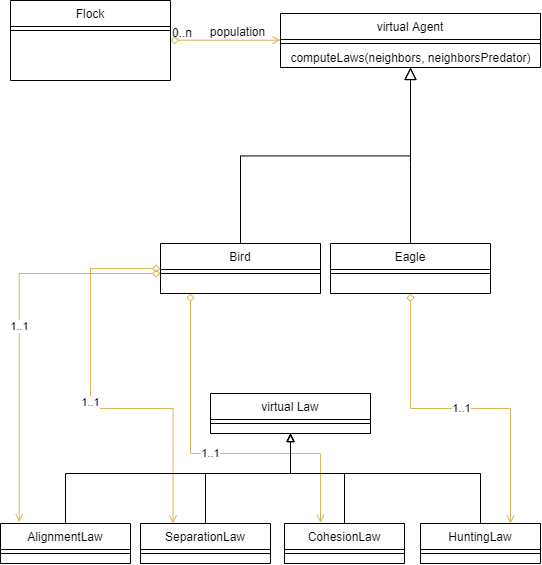

### The flock
The flock constitutes the ensemble of the environment, agents and interactions simulated by the program, in a way that only one flock can be generated and displayed to the user.
In technical terms, the flock is represented by a class, the highest class in the code hierarchy whose instantiated object will incorporate most of the other objects in the project. It hosts, for example, all of the birds and predators in the project.
The only attribute of this class is a vector of pointers to *Agents*. An Agent can be interpreted as a living being belonging to the flock, such as a bird or an eagle, which will interact with other agents around him. Thus, this vector points to the data representing the actual flock.
This vector can be modified according to agents or user interaction by the methods of the class Flock. Therefore, the vector (representing the flock) can grow, when an agent is added, or can decrease in size, when an agent is removed. It methods also permits to access information of the flock, such as its size or specific agent.

### Agent
As already stated, an agent is an active member, a living being of the flock. It is represented in the code by a class that, when instantiated, will create the objects belonging to the Flock vector.
In practice, though, this class can never be instantiated, as it intends only to be a parent class for two other child classes:

- Bird
- Eagle

Which instantiated objects will then inherite or override the general properties and methods of an agent.
The agent, for example, has a position and velocity representing the values perceived by the user in the last time step. In order to compute the interactions between agents/user in the current time step, another position and velocity are also stored, according to its own speed limit. Other properties related to the interface are body size and color.
The interaction between agents occurs only if they are within a certain range and view angle (according to its own movement direction). All this properties can be different pursuant to the agent type - eagle or bird (and even type of bird). In addition, each child class has its own specific attributes and methods to determine its behaviour.
The attributes in the Agent class, are all *protected*, thus they can only be accessed from its own methods or from their child classes, but not from outside. In the last case, interface methods are provided to access and set such properties.

### Bird
The objects of this class will represent, intuitively, the birds of a flock. The instantiation of a Bird is done by a constructor which will simply call the *Agent constructor* with certain specific values. The position and velocity, for example, are randomly chosen within certain boundaries, whereas the size, range and view angle (270°) are set to constant values.
The bird's behaviour, on the other hand, is determined by a group of rules/laws represented and computed by private methods:

* Cohesion law
* Separation law
* Fleeing law
* Alignment law

Each of these will contribute to modify the computed speed of the bird, and therefore its position and direction of movement.

#### Cohesion law
The cohesion law is the law responsible for the agents trying to move closer to their viable neighbors, as such a Bird will try to get closer to the Birds found in its field of vision.
In practice, this law computes a barycenter for all the viable neighbors who are in the visible range of a Bird and not in its vital avoidance cell. The displacement, which is the difference between the actual velocity of an agent and its next velocity, of this Bird will then be modified to enable reaching the location of this barycenter, more or less quickly depending on the relaxation of this law.

#### Separation law
The separation law is the law responsible for the agents not clustering on top of each others.
This effect is obtained using the inverse of the square distance between two agents as a weight, meaning that in practice closer two birds become the more the separation will be strong, up to a degree where it can virtually negate the effects of the other laws.
In practice, this law adds a component to the displacement of an agent representing the weighted sum of the movements created in the opposite direction of each chosen neighbors.
This law is used two times during a Bird displacement calculation, one with it's Birds neighbors, and one with it's Eagles neighbors using a higher weight to represent an attempt to "escape" (previously mentionned as fleeing law).

#### Alignment law
The alignement law is the law responsible for the tendency of the agents of a cluster, created by the effects of the two preceding laws, to obtain a common facing direction with their neighbors found in their respective fields of vision.
In practice, this law adds a component to the displacement of an agent representing a mean between the actual velocity of its viable neighbors.

### Eagle
The objects of this class will, intuitively, represent eagles. Eagles are predators, and their role in the flock is to chase birds and eat them.
Similar to the class Bird, this one also calls the *Agent constructor*, although with different parameters like a smaller size and range, different color and narrower view angle.
The behaviour of an eagle is also different from a bird, and it is determined by only one law:

*  Hunting law

As in *Birds*, these laws will be computed and modify the position and velocity of the eagle.

#### Hunting law
This law is responsible for the predator chasing the birds. If there are bids in the eagle's view angle and range, a random prey is chosen to be the focus of the chase at each time step. This means that the predator's velocity will scale according to the prey's velocity - that is, the eagle will intersect the bird at its next position.
If the eagle gets close enough to its prey, it will *feed* from it; In programming terms, the object *Bird* will be destroyed from memory and the removed from the Flock vector, also disappearing from the graphical user interface. After feeding, the eagle grows in size, until a certain limit; overcoming this limit, the predator will divide itself - that is, return to its original size and create 2 other predators in the same position.

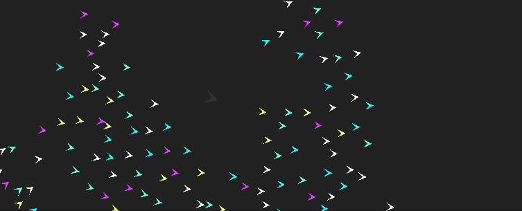

### Laws
The previously cited laws are children classes of a virtual parent class Law.
Those laws are the core of the design of this program, and represent most of its need for computing ressources when associated with the calculation of the neighbors needed to get the effects of a law on an agent.
In technical terms, the Law class includes in particular a protected relaxation variable which represents how smooth an agent will react to a given law, a protected law constructor which is used for the instantiation of its children classes, and a public method named compute which is overriden by each children laws in order to modify the next velocity value of an agent.
Having considered that, it is important to notice the interactions between the laws and not a law by itself, and in particular the complementary laws affecting a Bird.
The weighted outputs of these laws form, after theirs respectives relaxation are applied, the displacement, which is a change in velocity enabling Birds to form clusters and Eagles to track their prey.

### Compute neighbors
In order to be able to calculate the laws of alignment, cohesion and separation, it was necessary to create the method "compute neighbors".
This method consists in going through a list of agents and checking the existence of a neighbor according to a precise range and to the angle of view of the agent (according to type of bird).

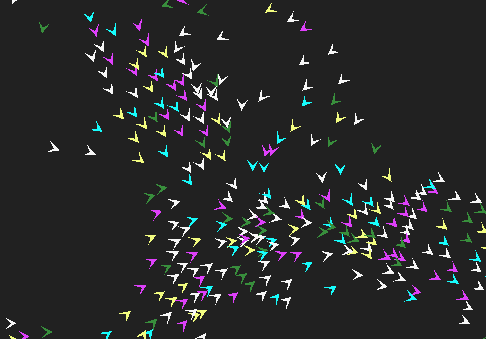

[Link to the file](https://git.sophia.mines-paristech.fr/hpc-ai_21/cpp-life-of-boids/-/blob/master/src/resources/model/Flock.cpp)

### First idea
There were different algorithms which were tested to try to reduce the time for looking for neighbors of a particular agent.

The first idea was to implement a _brute-force_ function. We keeped it during the project to guarantee that we could find all neighbors for each iteration of a agent.

This algorithm has a complexity of `O(n²)`.

### Second idea

A second approach was to compute neighbors at the initialization and for next iteration, to compute new neighbors according to the previous computation.
But there was a main issue. If a new neighbor approaches a agent and was not detected at the last iteration, it will not be taken into account.
So this idea has been given up.

### Third idea

The third approach was to calculate **all norms of positions** and angles with the **X axis** and store them in two arrays `[norm, angle, index_of_agent]`.
The next step is to sort them :
- the first one according to _norm_ criteria
- the second one according to _angle_ criteria

Now, for each agent, we look for 4 indexes thanks to dichotomy functions:

`agent.norm - agent.range < neighbor.norm < agent.norm + agent.range` so 2 indexes:
- the lower index where the norm of the neighbor is the closest to `agent.norm - agent.range`
- the greater index where the norm of the neighbor is the closest to `agent.norm + agent.range`

Let gamma the angle between the current agent and the **X axis** `float gamma = pos.angle();`
Let alpha the angle between the current agent and the straight line through `O(0, 0)` tangent with the _proximity circle_
`float alpha = std::asin(range / norm);`

`gamma - alpha < neighbor.angle < gamma + alpha` so 2 indexes:
- the lower index where the angle of the neighbor with X axis with is the closest to `gamma - alpha`
- the greater index where the angle of the neighbor with X axis is the closest to `gamma + alpha`

So here is a diagram :

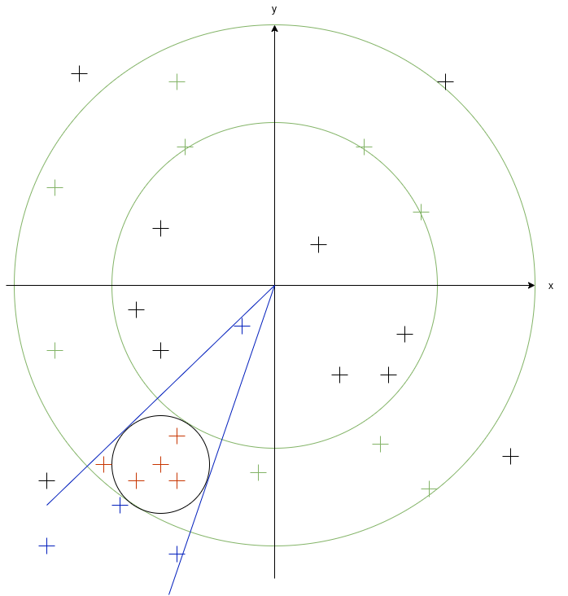

Once indexes obtained, we can do an intersection between the two last sorted arrays but limited by the last computed indexes.
At the end, we iterate on the intersected array and check if they are really neighbors.

So we reduced time of looking for _potential neighbors_.
The complexity of sorting is `O(n log(n))`. It is done only once per main iteration.
For each agent, we look for indexes with a complexity of `O(log(n))`. So in total we have `O(n log(n))`.
To do the intersection, we have to sort arrays (`O(m log m)` with `m < n`)
The intersection has a complexity of `2 * (m1 + m2)` where `m1` is the size of the first array and `m2` is the size of the second array.

Finally, what takes the most of the time is to sort arrays before intersection
To get an idea :
- without sorting part : `~ 2.5 ms`
- with sorting part : `~ 100 ms`

There is an issue. When we compute angles, they are spread on `[-pi, pi]`. So what happened when `gamma - alpha < -pi`, `gamma + alpha > pi`, `norm < range` ?
- `norm < range` implies that the agent is close to `O(0, 0)` and also neighbors are close to the center. So our research is only on radius.
- `gamma - alpha < -pi` implies that the agent is near and under -X axis. So there are some neighbors between `[beta, pi]` and some neighbors between `[-pi, gamma + alpha]` where `beta = 2 * pi - alpha + gamma`. So we must get agents in these two intervals
- `gamma + alpha > pi` same idea but the agent is near and over -X axis.

In the end, the complexity is `O(n * m * log(m))` where `m = max(m1, m2)` where `m1` is the size of the first array (norm criteria) and `m2` is the size of the second array (angle criteria).

We don't go in detail, we prefer to explain the last idea.

### Final idea
Instead of using polar coordinates, we used cartesian coordinates. Thus, the goal is to start to sort according to X values and Y values and after it's the same idea but without difficulties of angle values overlapping and proximity with center `O(0, 0)`.

Here is a diagram :

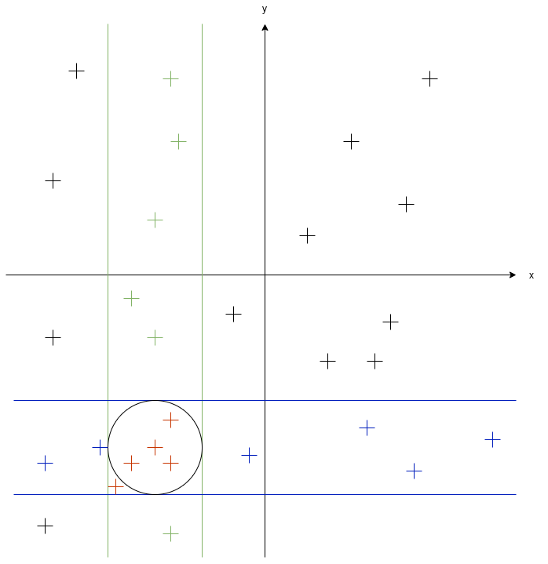

So we form 2 arrays : one sorted according x values and one sorted according y values.
The algorithm is simplified with this approach :


[Link to the file](https://git.sophia.mines-paristech.fr/hpc-ai_21/cpp-life-of-boids/-/blob/master/src/resources/model/Flock.cpp)


So we have the same complexity (`O(n * m log (m))`) as the last algorithm (with polar coordinates) and same problem of sorting data. But it's easier to understand with less problems of overlapping values.

### Time comparison

Size = 4000
Mode = Release
Number of iterations : 5

Origin algorithm:
```
t = 0
855526 microseconds
t = 1
857578 microseconds
t = 2
858058 microseconds
t = 3
858655 microseconds
t = 4
861274 microseconds
```

New algorithm :
```
t = 0
106210 microseconds
t = 1
106332 microseconds
t = 2
108424 microseconds
t = 3
107619 microseconds
t = 4
106723 microseconds
```


### Flock generator and color
There are differents level of personalization of Flocks generating according to the choice of the user :
This code contributes to generate different types of Birds in a Flock (Duck, Ant, Dove, Parrot,...),
with differents attributes (flock_size, range, angle_view, agent_size, cohesion_relax, sep_relax, align_relax, speed_relax, position, velocity, agent_color).
The color of the birds can be chosen to be random.

Angle view is 360, range 70<br />

```generate_duck_flock(int size);```

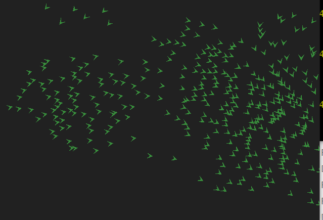

```generate_ant_flock(int size);```

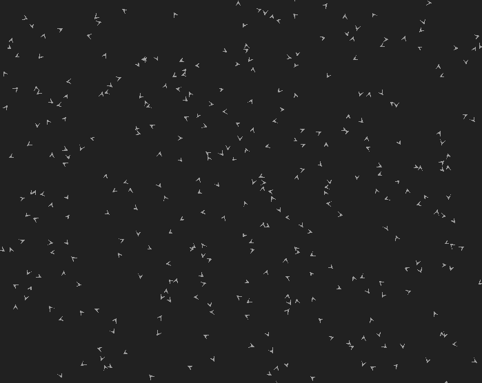

Angle view is 270, range is 50<br />

```generate_dove_flock(int size);```

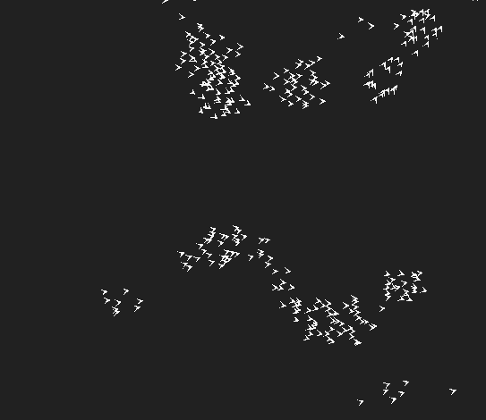

Angle view is about 300, range 50<br />
```generate_parrot_flock(int size);```

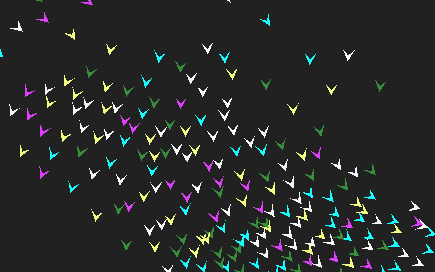

Everything randomized<br />
```generate_fully_random_bird_flock();```

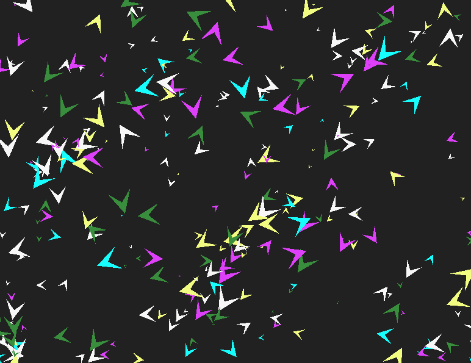

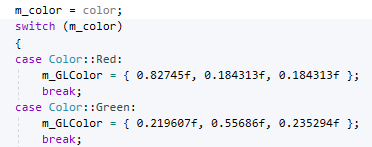

# User configuration
Now that we have implemented a flock generator, which can be used in many ways in the code, we want to be able to let the user configure his flock. This can be done by using options (c.f. chapter **Running the program - Options**).
To implement this, we used ```argc``` and ```argv[]``` parameter of the ```main``` function.

The order of the options are specific, and a different code is triggered depending on the number of arguments the user gave.

These options are thought to be user-friendly, which means that the user will be informed if he/she entered a wrong number of arguments, of a weird number (e.g. a size of flock of 0). The program will either warn the user if he/she is fully configurating the flock (with all options possible), or it will throw an exception if the user wants to use the _easy_ options (0, 1, or 2 arguments).

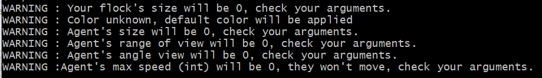

To be the most user friendly possible, we created some birds template, with given values for eveything (range and angle of view, size, color, laws' relaxations) so the user can try the program without knowing about the _complex_ options like laws' relaxations.

If the user uses the most complex generation of flock, he/she will be informed on the flock, to be able to adjust new parameters easily.

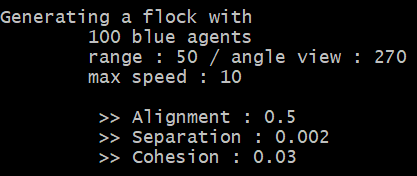

These options could have been managed in a easier way using the C++ library ```options```, allowing the user to mark the option he/she wanted with a dash ```-```. This will be integrated next release.


<a name="graphical-manager"/>

## Graphical Manager
The goal of the GraphicalManager class is to wrap-up all the OpenGL components of the code to make development easier.
The GraphicalManager constructor initializes and manages OpenGL variables and our graphical variables to help us draw the shapes we want.

Some of the tasks it is assigned are :
- Creating the window
- Setting up the shaders programs
- Activating the shaders programs
- Creating the OpenGL buffers
- Initializing and defines variables needed to draw our shapes
- Linking our key and mouse callback functions with OpenGL event management
- Setting up the colors

This class also implements a method called "mainLoop" that, when called, executes one loop. Namely, it launches the calculations of the next positions of the Agents making them move and then proceeds to draw them. </br>
It's possible to draw the agents either as triangles or as points, even though at small number of agents it does not affect performance. We created a class "AgentDisplayer", called by GraphicalManager, implementing DotDisplayer and TriangleDisplayer to take care of the correct display conditionally. 

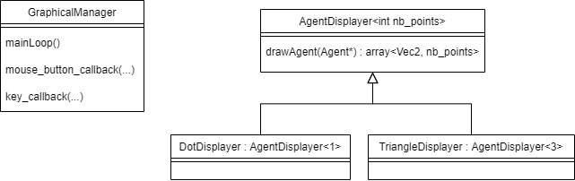

It supports the display in windowed screen or fullscreen, and the Agent drawing as triangles or points.

Finally, the GraphicalManager destructor takes care of closing the window and cleaning the OpenGL variables before ending the program.

## FPS
FPS calculates the time needed to create an image and calculates the number of images created per second.
```cpp
		auto start = high_resolution_clock::now();
```
```cpp
		auto stop = high_resolution_clock::now();
		auto duration = duration_cast<microseconds>(stop - start);
		std::ostringstream oss;
		oss << 1 / (duration.count() * 10e-7) << " FPS. " << std::endl;
		glfwSetWindowTitle(m_window, oss.str().c_str());
```

<a name="continuous-intergration"/>

# IV.   Continuous integration
## Git management
It is not trivial to work in a team of seven people. At first, there we had no particular git management, the rule was to make a merge request on master when we felt our changes was good (compiles and runs on MSVC). Due to some accidental pushes on master, making the master branch not compilable, we started to think of a way to manage our git branches.
The idea was to make a new branch ```dev```, in which no one is allowed to push, one can only update it using merge requests. This ```dev``` branch is our main development branch, while the ```master``` branch is blocked both for pushing **and** merging.

The ```master``` branch is unlocked when we have a stable version of the program, that we know can be delivered. In such a case, we allow ```master``` to be merged, and when it is, we re-block it again. This both separates our final product, and our development product on two different branches, but it also covers us against accidental pushes on a branch that compiles and runs.

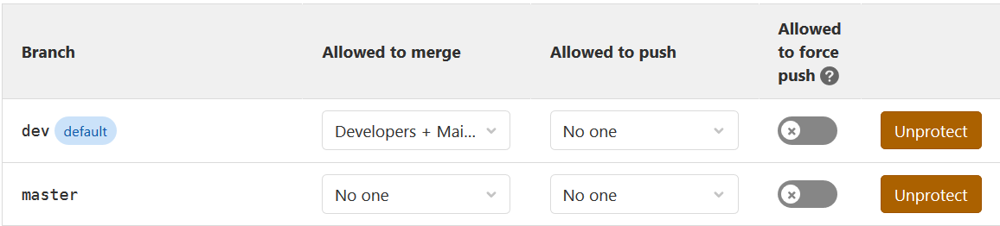

Although this git management was way better than what we did at the beggining of the project, we were only building and testing our program on one compiler, MSVC. And all this had to be done by hand. The next thing we needed was to integrate continuous integration to our project.

## CI Pipeline
Now that we have a nice branch management, and a good merge request system, the only thing missing is a good pipeline which gets triggered for every push and merge request.
 We started by using the Docker image ```conanio/gcc9``` so conan and gcc are both included and we don't have to start an image from scratch.
 Some external packages are needed to compile and run our program : ```libgtk2.0-dev``` and ```libgl1-mesa-dev```. The installation of these files take a few minutes (about 5). Since the docker image is cleared at the beginning of a new pipeline, we had to make these installation everytime. Since a new pipeline is created for **every pull**, which means that the developper has to wait **5 minutes** everytime he/she pushes. Better not miss a semi-colon ! We will develop what actions we decided to take in order to palliate this issue. 
Now, when a developer pushes his/her branch, the new pipeline is triggered, the code is compiled on both GCC9 and Clang10 compilers, and tests are run on both these environments. In a merge request process, if the pipeline has not succeeded, the request is blocked until someone pushes a commit to fix the issue. This workflow allows us to continuously keep a clean code, which is portable on 3 different compilers. 
All of this experience has shown us that some compilers do work that other won”t do, in which case we have to make this work explicit it in the code (most often is include problems, MSVC will automatically include some files and library needed for the project, which Clang won’t do).

## Docker
In order to run the builds in Continuous Integration Pipelines, docker images are needed in order to execute the commands of the pipeline. Namely the different stages needed are : 
- The installation of the dependencies with conan
- The building job with various compilers
- Executing the tests

The first continuous integration pipelines were really time-consuming because it included downloading all the packages with conan commands. With the introduction of the <em> Clang </em> compiler, some of the dependencies weren't directly downloadable via conan. These packages needed to be downloaded as source code, and then built from source. This stage of building from source the missing packages is extremely long ( $\simeq$ 20 minutes) and it wasn't possible to wait this long at each pipeline. 

We decided to build new docker images, with prebuilt and installed dependencies for both compilers <em> GCC </em> and <em>Clang</em>. Two images were build from <em>conanio/gcc9</em> and <em>conanio/clang10</em> with our files.<br>
It enabled us to iterate faster on our portability with other compilers.


<a name="profiling-performance"/>

# V.    Profiling/performance computing
## Valgrind
In order to improve the performances of the program, it is necessary to discover the sections of code that use the most resources. Valgrind is a Linux tool designed to help programmers analyze their code at runtime to get these precious informations.
Valgrind simulates every single instruction the program executes. Because of this, the active tool checks, or profiles, not only the code in the application but also in all supporting dynamically-linked libraries, including the C libraries, and so on.
 It is used with the built executables, called with valgrind commands. For example, the command we used was :
 `valgrind --tool=callgrind ./main_profiling`
 This command is slow, because the tool analyzes the code at runtime, and produces at the end a <em>callgrind.out</em> file containing thousands of text lines. It is nearly impossible to read it, so we use a graphical interface in which the information is much clearer.

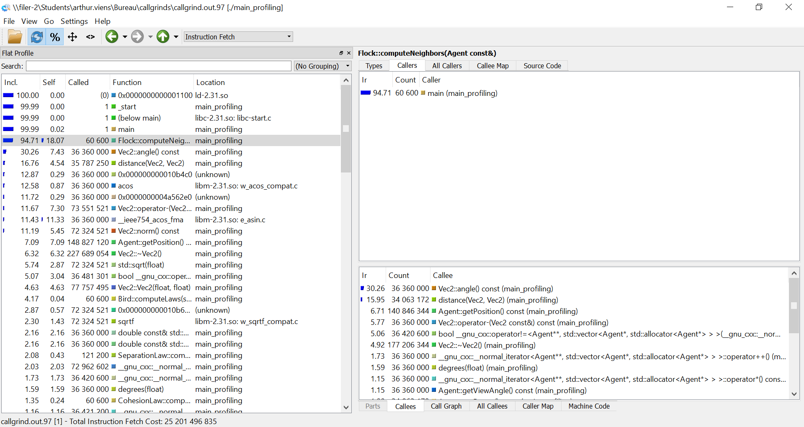

We can see in the left pannel the different functions or methods called in our program, with their share of instruction fetch in blue relatively with other functions and methods. We can also see different informations, such as the % of self instruction fetch, excluding those of the callees, the number of times it has been called... <br/>
The right pannel contains more detailed informations about the function we selected in the left panel.
For example, as we can see in the image, there is all the functions that `Flock::computeNeighbors ` called. We see that 30% of the processors instructions fetch is used to calculate the angle of our vectors `Vec2`.
Another view of this type of information is the <em> Call Graph </em> of which we can see an example below :

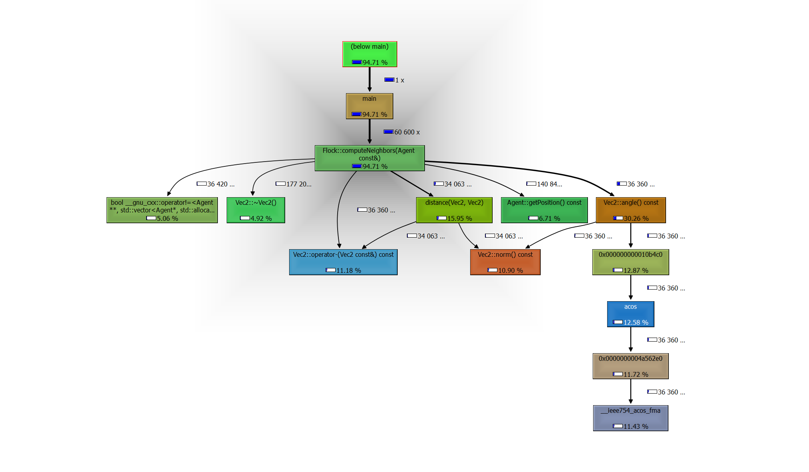

We can easily and rapidly see who called who, and what are the share of resources each callee uses.
These informations were used to perform some minor optimisations in term of copies/references. However, the test and development iteration process of this methode is slow because we have to re-build on Linux, re-run valgrind at each development. It is also difficult to see wether the change did or did not have an impact on program performance, because the weights of the instruction fetches are relative and not absolute.
Even though we knew `Flock::computeNeighbors` was the function using most of the resources, we have not managed to reduce significantly the computational cost of this method. It was difficult to pinpoint where to reduce cost in, for example, `getPosition`, `angle`, `distance` etc. 
We tried to implement the move constructor and move operator but it did not seem to have an impact on performance.

After taking a step back, we can determine some parts to improve and limits.

<a name="limits-and-ameliorations"/>

# VI.   Limits and ameliorations

Theses are the next amelioration we aim for our project :
- Threads (up to 4 times faster)
- Global performance ([_k-d tree_](https://en.wikipedia.org/wiki/K-d_tree) algorithm to compute neighbors)
- More user configuration
- Dynamic informations on screen (laws' relaxations, speed, etc...)
- More class independance (mainly on OpenGL)
- More code covered in the tests